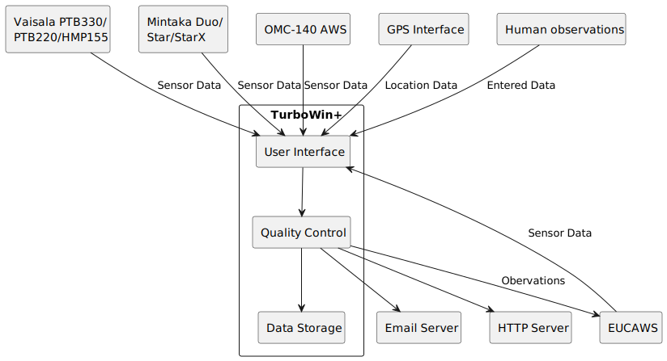

# Building Block View
* Observation checking routines with quality checks
* Support for various meteorological interfaces (Vaisala, Mintaka, EUCAWS, OMC-140 AWS, GPS)

## Whitebox Overall System

## Whitebox System

Separate windows are used to fill in certain types of meteorological data. A main window is the central UI.
