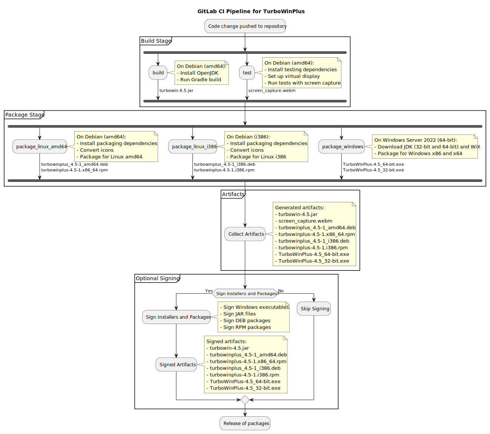

# Deployment View
- TurboWin+ can be installed manually via installers on ship-based and fixed sea stations
- Runs regardless of the operating system
- No pre-installed Java is needed

## Build and Release Management

### Continuous Integration (CI) Pipeline

A GitLab CI pipeline is used to automate building, testing, and packaging TurboWin+ across multiple platforms.

#### Pipeline Overview

The pipeline is defined in the `.gitlab-ci.yml` file and comprises the following stages:

- **build**
- **package**

#### Variables

The pipeline uses predefined variables to parameterize the build and packaging steps:

- `APP_NAME`: **TurboWinPlus**
- `LICENSE_FILE`: **LICENSE**
- `VENDOR`: **KNMI**
- `ICON_PATH_LINUX`: Path to the Linux icon file.
- `ICON_PATH_WINDOWS`: Path to the Windows icon file.

#### Stages and Jobs

##### 1. Build Stage

- **build**

    - **Purpose**: Compiles the application code.
    - **Image**: `debian:bookworm` (64-bit)
    - **Script**:
        - Updates the package manager and installs OpenJDK.
        - Extracts the version number and stores it for later jobs
        - Executes the Gradle build task, excluding tests.
    - **Artifacts**:
        - Stores the compiled JAR file e.g. `turbowin-4.5.jar` from `build/libs/`.
        - Artifacts are retained for 1 hour.

- **test**

    - **Purpose**: Runs automated tests with screen capture.
    - **Image**: `debian:bookworm` (64-bit)
    - **Script**:
        - Installs necessary packages for GUI testing and screen capture.
        - Sets up a virtual display environment using Xvfb.
        - Initiates screen recording with FFmpeg.
        - Runs the Gradle test task.
        - Trims the screen recording to exclude idle time.
    - **Retry Policy**: Retries up to 2 times on failure.
    - **Artifacts**:
        - Stores the screen capture video `screen_capture.webm`.
        - Artifacts are retained for 1 hour.

##### 2. Package Stage

- **package_linux_amd64**

    - **Purpose**: Packages the application for Linux amd64 architecture.
    - **Image**: `debian:bookworm` (64-bit)
    - **Extends**: `.package_linux_template`
    - **Script**:
        - Converts Windows icon to PNG format using `icotool`.
        - Uses `jpackage` to create Debian and RPM packages.
    - **Artifacts**:
        - Stores packages e.g.:
            - `turbowinplus_4.5-1_amd64.deb`
            - `turbowinplus-4.5-1.x86_64.rpm`
        - Artifacts are retained for 1 hour.

- **package_linux_i386**

    - **Purpose**: Packages the application for Linux i386 architecture.
    - **Image**: `i386/debian:bookworm` (32-bit)
    - **Extends**: `.package_linux_template`
    - **Script**: Same as `package_linux_amd64`.
    - **Artifacts**:
        - Stores packages e.g.:
            - `turbowinplus_4.5-1_i386.deb`
            - `turbowinplus-4.5-1.i386.rpm`
        - Artifacts are retained for 1 hour.

- **package_windows**

    - **Purpose**: Packages the application for Windows x86 and x64 architectures.
    - **Tags**: `saas-windows-medium-amd64` (Hosted GitLab.com runner with Windows Server 2022 64-bit)
    - **Variables**: Specifies URLs for JDK and WiX Toolset.
    - **Before Script**:
        - Logs the start time and user initiating the build.
    - **Script**:
        - Downloads and extracts OpenJDK and WiX binaries.
        - Uses `jpackage` to create Windows installers for both architectures.
    - **Artifacts**:
        - Stores installers e.g.:
            - `TurboWinPlus-4.5_64-bit.exe`
            - `TurboWinPlus-4.5_32-bit.exe`
        - Artifacts are retained for 1 hour.

#### Pipeline Visualization

The following diagram illustrates the CI pipeline flow and the resulting artifacts:

---
